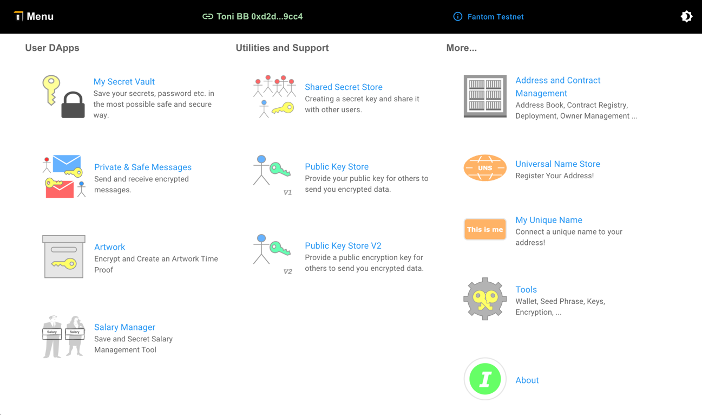

<h3 style="alignment-baseline: center">An  Initiative</h3>

# Blockchain Apps Documentation

_Blockchain Apps_ is an OOIT.com initiative exploring the potential of blockchain technology.

## Key Topics

- **Development**: Building, testing, and deploying smart contracts (EVM compatible)
- **Data**: Storing, retrieving, and securing data on blockchains
- **Scaling**: Handling large datasets (e.g. with Arweave)
- **Efficiency**: Transaction costs and speed
- **Security**: Account, roles and private key management
- **Comparisons**: Understanding Blockchain vs. traditional and cloud apps

## Proof of Concept Apps

To promote the gained knowledge and suggested topics a set of POC Apps have been implemented.

- **[Universal Naming Service](universal-naming-service%2Funiversal-naming-service.md)**
- **[My Secret Store](secret-store/secret-store.md)**
- **Artwork Proof** (timestamping and authenticity)
- **[Secure Blockchain Table (SBT)](secure-blockchain-table/secure-blockchain-table.md)**: Highly secure, Excel-like
  data storage
- **Address Book** (global, company-wide, personal)
- **Document store**: User can save documents (encrypted/unencrypted) in a folder structure and create QR codes and
  links
- **Pure Blockchain Website**
- **Medical Record**: User can upload medical records (fully encrypted) and Produce a QR Code a doctor can scan and open
  for emergency.
- **Payable Messages**: Use gets money for reading and confirming mails a company/user sent him
- **Payable Adds**: Similar to the above: user can read adds and comment and gets money for that
- **Meeting Support**: Supports highly confidential meetings (with documents, agenda, resolutions)
- **Invitation Support**: User sends an invitation (per mail) to a person A with a small amount of money. If person A
  creates/uses his account he gets the amount. User can revoke the invitation any time
- **Simple Card Game** playing a card game online with small amounts of money/game token

For more, see the [POC Roadmap](poc-roadmap.md).

## Functional Goals

- Using price sources for crypto values
- Integrate Solidity Event
- Fail-over with backup provider
- Explore cryptographic libraries (etc. nacl)
- Explore Zero-Knowledge functionality
- 

## DevOps Support

We're also investigating essential DevOps tasks for business applications:

- Contract Deployment and Verification
- Contract Management (Ownership, Access Control)
- Key Management
- User Authentication and Authorization
- Contract Naming and Registry

## Dev Stuff

Various miscellaneous aspects for development

- [Developers Bookstore](dev-stuff/dev-bookstore.md)
- [EVM and Database](dev-stuff/evm-and-database.md)
- [Big Numbers](dev-stuff/big-numbers.md)

## Various Topics

- [Solution for Lost or Stolen Keys](various-topics/solution-for-lost-or-stolen-keys.md)
- [Network Id and Chain Id](various-topics/explain-networkid-and-chainid.md)

