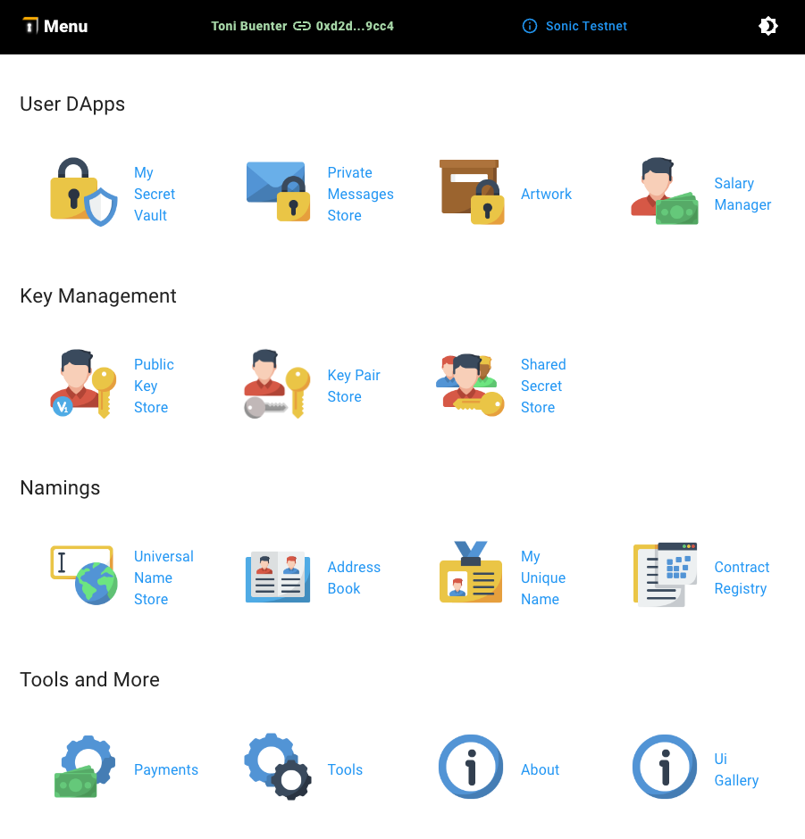

<h3 style="alignment-baseline: center">An  Initiative</h3>

# Blockchain Apps Documentation

This document outlines the "Blockchain Apps" initiative from OOIT.com, focused on exploring practical uses of blockchain
technology.

## What We're Doing

We're researching and developing applications that leverage blockchain for various purposes, including:

- **Improved Data Management:**  Securely storing, retrieving, and managing data on blockchains. This includes exploring
  solutions for handling large datasets efficiently.
- **Development**: Building, testing, and deploying smart contracts (EVM compatible).
- **Scaling**: Handling large datasets (e.g. with Arweave).
- **Efficiency**: Transaction costs and speed.
- **Enhanced Security:**  Developing robust methods for account management, role-based access control, and private key
  security.
- **Increased Efficiency:** Optimizing transaction speeds and minimizing costs associated with blockchain operations.

## Our Projects

We've built several proof-of-concept apps to demonstrate the potential of blockchain:

- **[Universal Naming Service](universal-naming-service%2Funiversal-naming-service.md)** A decentralized way to manage names and properties for accounts and contracts.
- **[My Secret Store](secret-store/secret-store.md)** Securely store sensitive information on the blockchain.
- **Artwork Proof** Verify the authenticity and timestamp of digital artwork.
- **[Secure Blockchain Table (SBT)](secure-blockchain-table/secure-blockchain-table.md)**: A highly secure, collaborative data storage solution similar to Excel, built on blockchain.
- **Address Book** A decentralized address book that can be used globally, within a company, or personally.
- **Document store**: Securely store and share documents with encryption and QR code functionality.
- **Pure Blockchain Website** Exploring the creation of websites hosted entirely on a blockchain.
- **Medical Record**: Allow users to securely store and share medical records with healthcare providers via QR codes.
- **Payable Messages/Ads**: Reward users for reading and interacting with messages and advertisements.
- **Meeting Support**: Facilitate secure and confidential meetings with document sharing and agenda management.
- **Invitation Support**: A blockchain-based invitation system with built-in incentives.
- **Simple Card Game** A demonstration of using blockchain for online gaming with cryptocurrency or tokens.

For more, see the [POC Roadmap](poc-roadmap.md).

We're actively working on:

## Functional Goals

- **Integrating price sources for crypto values.**
- **Utilizing Solidity events for enhanced functionality.**
- **Implementing fail-over mechanisms with backup providers.**
- **Exploring cryptographic libraries (like NaCl) for advanced security.**
- **Researching and implementing zero-knowledge proofs for privacy-preserving applications.**
- **Improving DevOps support for blockchain applications, including contract deployment, management, key management, and user authentication.**

## DevOps Support

We're also investigating essential DevOps tasks for business applications:

- Contract Deployment and Verification
- Contract Management (Ownership, Access Control)
- Key Management
- User Authentication and Authorization
- Contract Naming and Registry

## Dev Stuff

Various miscellaneous aspects for development

- [Developers Bookstore](dev-stuff/dev-bookstore.md)
- [EVM and Database](dev-stuff/evm-and-database.md)
- [Big Numbers](dev-stuff/big-numbers.md)

## Various Topics

- [Solution for Lost or Stolen Keys](various-topics/solution-for-lost-or-stolen-keys.md)
- [Network Id and Chain Id](various-topics/explain-networkid-and-chainid.md)

