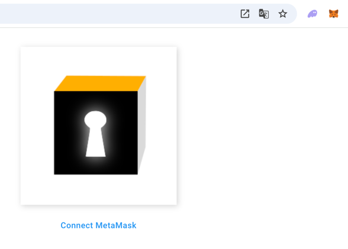

<h3 style="alignment-baseline: center">An  Initiative</h3>

# My Secret Store

My Secret Store functions much like a password manager, but with the added benefits of blockchain technology:

- **Unmatched Security**: Your secrets are safe as long as you protect your private key.
- **Indestructible**: Data stored on the blockchain is tamper-proof and outlasts any cloud provider.
- **Client Independence**: Access your secrets from anywhere, without relying on a specific platform.
- **Decentralized Storage**: Only the smart contract holds your encrypted data.

## Key Features

- **Strong Encryption**: Your passwords are encrypted with your private key for maximum security.
- **Blockchain Storage**: All data is stored exclusively on the blockchain in encrypted form.
- **Cross-Chain Compatibility**: Available on Ethereum, Polygon, and Fantom networks.
- **Testing**: Try it out on the Fantom Testnet.

## Screen Shots

You have to connect with MetaMask.

List of entries (Blockchain: Fantom Testnet):

## Add entry

### New Entry before encryption

### New Entry after encryption

### Save Encrypted Entry

Saving the encrypted Entry need FTM (about <0.002, <0.001$) for the transaction:

### Waiting till transaction is finished

