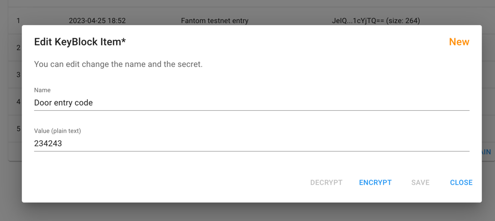
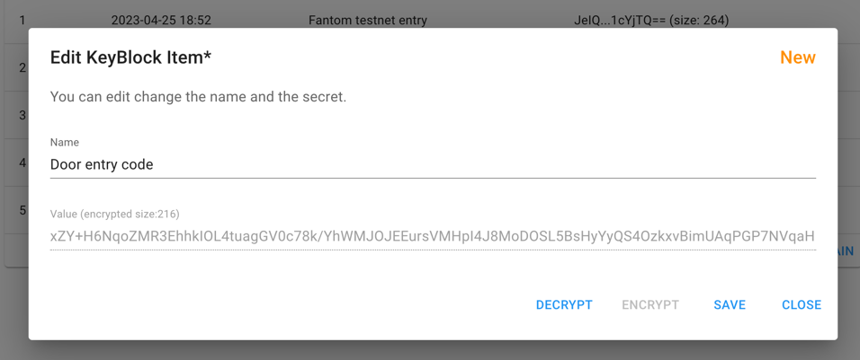
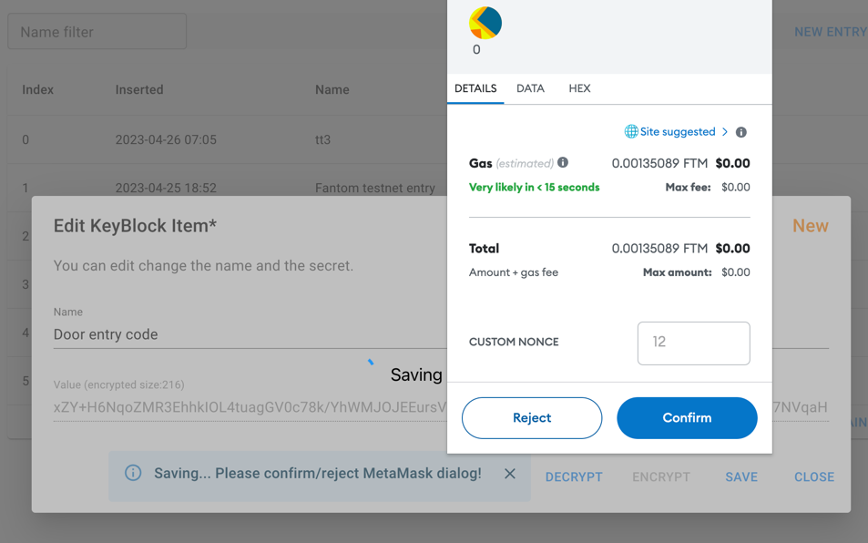
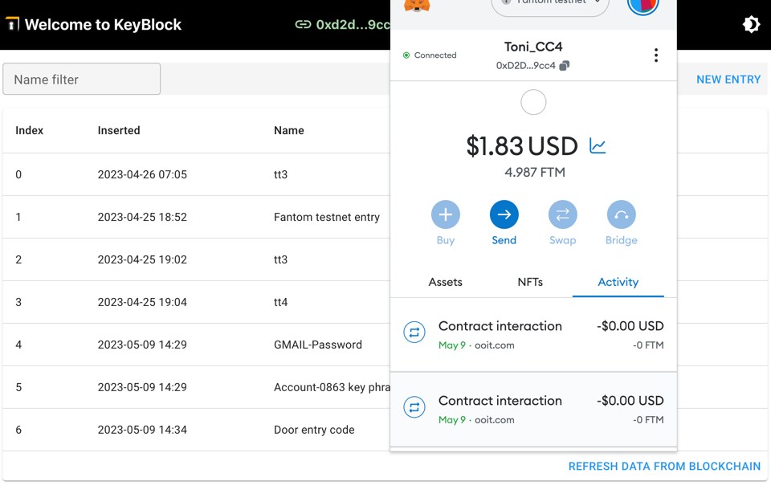

# Secret Store

The Secret Store a very similar to a password storage application.

The blockchain characteristics are:

- Very save as long as you keep the private key save
- Undestructible: better than any cloud provider
- 100% client independency
- Only contract keeps data

## Requirements

- Fully encrypt your passwords with your private key
- All data is stored only encrypted and on the blockchain
- Available on: Ethereum, Polygon, Fantom
- Testnet: Fantom Testnet

## List of secrets

You have to connect MetaMask or a passphrase to the Dapp.

List of entries (Here using Fantom Testnet):

## Add entry

### New Entry before encryption

### New Entry after encryption

### Save Encrypted Entry

Saving the encrypted Entry need  FTM (about <0.002, <0.001$) for the transaction:

### Waiting till transaction is finished

