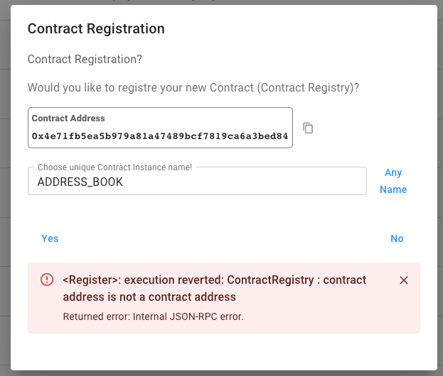

# Registration Error After Deploying Contracts

Due to blockchain traffic, contract registration can fail if deployment is still in progress. This is an inconvenience, not a bug. Future versions may handle this in a single transaction.

## Solution

Wait one minute and try to register again. Make sure to save the address manually in case you want to register later.
