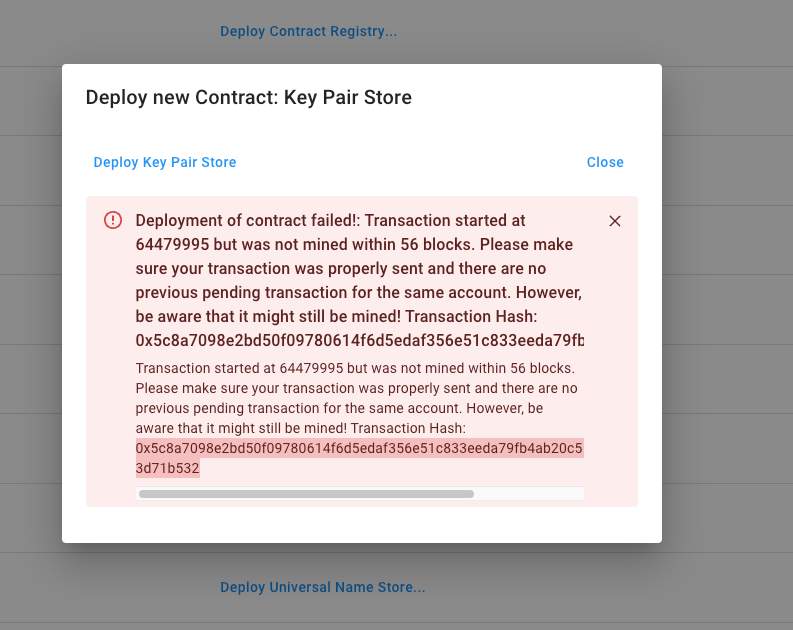

# Metamask Waiting

Executing transactions cause MetaMask to pause the application till the status leaves 'pending' . 

Depending on the blockchain, the transaction can take a few seconds to a few minutes or even timeout and return with a message like:

