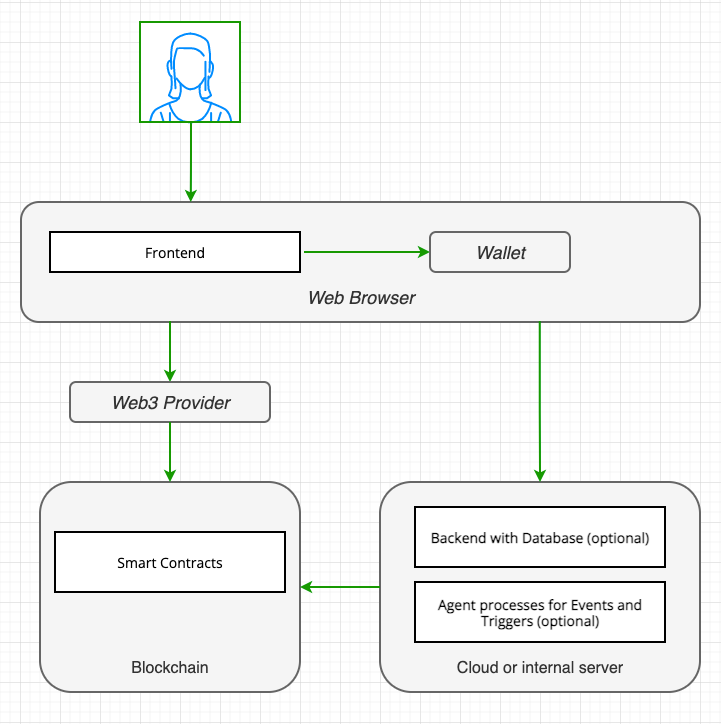

# Web3 App Architecture

## What are the Architectural Comp of a Web3 App?

A Web3 App comprises the following components:

- **Frontend**: The user interface that interacts with the blockchain.

- **Smart Contracts**: Programs that run on the blockchain.

- **Backend with Database (optional)**: Specific backend services deployed on a cloud or internal server with a
  database and other resouces.

- **Agent processes for events and Triggers (optional)**: Programs processing events and triggers.

## Context Diagram

The following diagram shows the architectural components in a networked context:

## Frontend

The frontend is considered to be a regular web applications build with JavaScript and HTML. It includes libraries to
access a Wallet (usually a browser-extension) and Web3 components for signing contract calls and encryption. Other
client technologies are not excluded.

## Smart Contracts

Smart Contracts are programs that run on the blockchain. They are written in Solidity, Vyper, or other languages. They
comprise Business Logic, Data, Value Transfer and Transactions.

## Backend with Database (optional)

Optionally a backend with a database can be used to store data that supplements blockchain data, enables analyses, integrates legacy systems and
connects to non blockchain resources.

## Agent processes for Events and Triggers (optional)

Agent processes can be used to monitor events and triggers on the blockchain and react to them. E.g. trading bots, monitoring, ready price data.
